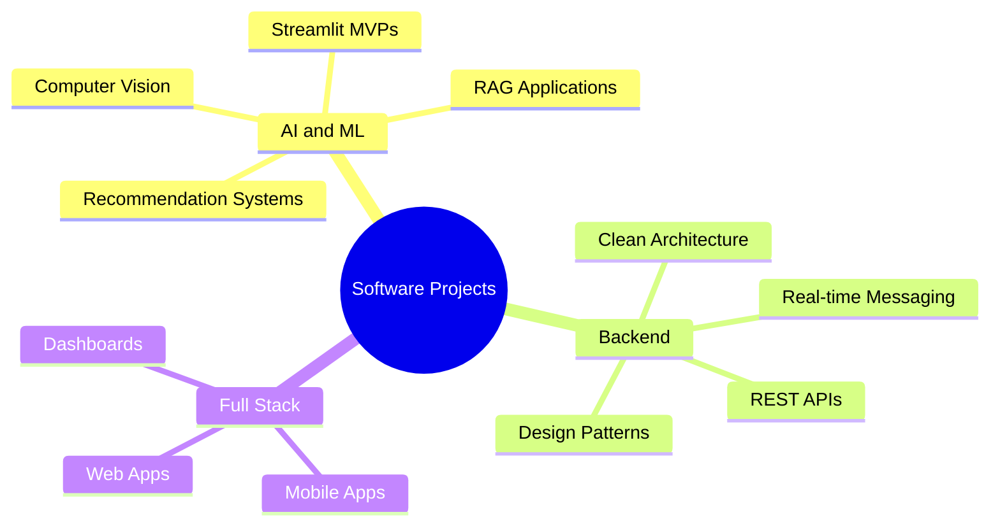

 

  
  
  <a href="mailto:demiralpberhan@gmail.com" target="_blank">
    

## 👋 About Me

I am a Computer Engineer who enjoys building real projects across **AI/ML**, **backend development**, and **full-stack applications**.

My work focuses on turning ideas into working software. I build machine learning models, Streamlit MVPs, backend APIs, real-time systems and mobile/web applications.

---

## 🧰 Tech Stack

---

## 📈GitHub Overview

  
  

---

## 📌 What I Like to Build

