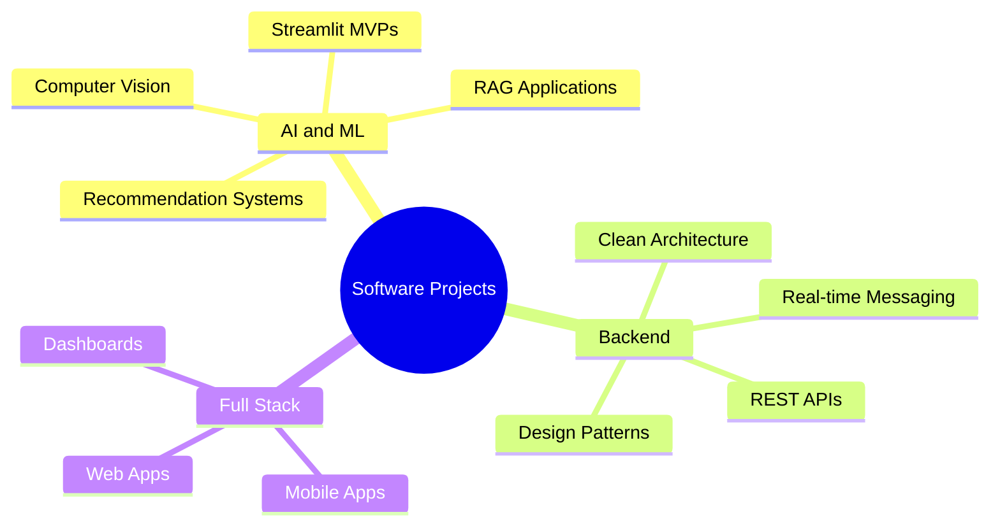

 

  
  
  <a href="mailto:demiralpberhan@gmail.com" target="_blank">
    

## 👋 About Me

I am a Computer Engineer who enjoys building real projects across **AI/ML**, **backend development**, and **full-stack applications**.

My work focuses on turning ideas into working software. I build machine learning models, Streamlit MVPs, backend APIs, real-time systems and mobile/web applications.

* 🤖 Interested in **AI/ML, Computer Vision, RAG systems and Recommendation Systems**
* 🧠 Working with **PyTorch, scikit-learn, OpenCV and Streamlit**
* ⚙️ Building backend systems with **C#, ASP.NET Core, TypeScript, NestJS, Prisma and PostgreSQL**
* 📱 Exploring app development with **Flutter and Dart**
* 🧩 I like clean architecture, design patterns and practical software engineering

---

## 🧰 Tech Stack

---

## 🚀 Featured Projects

<table>
  <tr>
    <td width="50%">
      <h3>🎯 DAiSEE Focus Tracker</h3>
      
Real-time focus score estimation app using face detection and a DAiSEE-trained PyTorch classifier.

      
<b>Tech:</b> Python, PyTorch, Streamlit, OpenCV

      <a href="https://github.com/BerhanDemiralp/daisee-focus-tracker">View Repository</a>
    </td>
    <td width="50%">
      <h3>💳 Credit Scoring ML</h3>
      
Machine learning project for predicting customer credit score classes with model comparison and Streamlit interface.

      
<b>Tech:</b> Python, Jupyter Notebook, XGBoost, scikit-learn, Streamlit

      <a href="https://github.com/BerhanDemiralp/Kredi-Skorlama">View Repository</a>
    </td>
  </tr>
  <tr>
    <td width="50%">
      <h3>💬 IUC Chat Bot</h3>
      
RAG-based chatbot for university documents using semantic search and vector retrieval.

      
<b>Tech:</b> Python, Streamlit, SentenceTransformers, Supabase, pgvector

      <a href="https://github.com/BerhanDemiralp/IUCHAT">View Repository</a>
    </td>
    <td width="50%">
      <h3>⚡ MOMENT Social Media App</h3>
      
Backend and OpenSpec workflow for a social media style app with auth and real-time 1:1 messaging.

      
<b>Tech:</b> TypeScript, NestJS, Prisma, PostgreSQL, Supabase, Socket.io

      <a href="https://github.com/BerhanDemiralp/SocialMediaApp">View Repository</a>
    </td>
  </tr>
  <tr>
    <td width="50%">
      <h3>🛰️ Image Segmentation Project</h3>
      
Semantic segmentation preprocessing pipeline with patch-based image processing and RGB mask encoding.

      
<b>Tech:</b> Python, PyTorch, OpenCV, NumPy, Jupyter Notebook

      <a href="https://github.com/BerhanDemiralp/ImageSegmentationProject">View Repository</a>
    </td>
    <td width="50%">
      <h3>🌱 e-Carbon AI</h3>
      
Carbon emissions tracking and reporting system for organizations with auditable data records.

      
<b>Tech:</b> C#, .NET, API Development

      <a href="https://github.com/BerhanDemiralp/e-Carbon">View Repository</a>
    </td>
  </tr>
</table>

---

## 📈GitHub Overview

  

  
  

  
  

---

## 📌 What I Like to Build

